# 04 · Canonical schema ERD

Org-centric ERD. `companies` is the universal org table; type-specific data lives in 1:1 extensions (`clubs`, `competitions`); multi-type via `company_org_types`; the org "weird web" via `org_relationships`. GPS lives in a separate DB and is **not** drawn — only one nullable, optional reference column points at it (`clubs.gps_org_id`). Integration = standardization + link, not merge (doc 07).

```mermaid
erDiagram
    sales ||--o{ companies : owns
    sales ||--o{ contacts : owns
    sales ||--o{ deals : owns
    sales ||--o{ tasks : owns
    sales ||--o{ activities : logs

    companies ||--o| clubs : "0..1 (club extension)"
    companies ||--o| competitions : "0..1 (league extension)"
    companies ||--o{ company_org_types : "has types"
    org_types ||--o{ company_org_types : ""
    companies ||--o{ org_relationships : "from"
    companies ||--o{ org_relationships : "to"
    companies ||--o{ deals : "deal target (any org)"
    companies ||--o{ contacts : "employs (current mirror)"
    companies ||--o{ company_brands : ""
    companies ||--o{ company_contacts : ""
    companies ||--o{ teams : "fields"
    clubs }o--|| companies : "plays in (league_company_id)"
    clubs }o--o| nations : "of"

    contacts ||--o{ contact_notes : has
    contacts ||--o{ company_contacts : ""
    contacts ||--o{ contact_social_profiles : has
    contacts ||--o{ tasks : "may target"
    contacts ||--o{ player_representations : "agent"

    deals ||--o{ deal_notes : has
    deals ||--o{ deal_modules : "xG modules"
    deals ||--o{ tasks : "may target"
    deals }o--|| brands : "branded"
    deals }o--|| pipeline_stages : "at stage"

    brands ||--o{ pipeline_stages : defines
    brands ||--o{ company_brands : ""
    company_brands }o--|| companies : ""

    company_contacts }o--|| companies : ""
    company_contacts }o--|| contacts : ""

    players ||--o{ player_org_assignments : ""
    players ||--o{ player_citizenships : ""
    players ||--o{ player_representations : ""
    players ||--o{ player_social_profiles : has
    players ||--o{ activities : "may target"
    player_org_assignments }o--|| companies : "org: club / national team"
    player_citizenships }o--|| nations : ""
    player_representations }o--o| companies : "agency (org)"

    activities }o--o| companies : ""
    activities }o--o| contacts : ""
    activities }o--o| deals : ""
    activities ||--o| tasks : "spawns follow-up"

    target_lists ||--o{ org_target_lists : ""
    target_lists ||--o{ player_target_lists : ""
    org_target_lists }o--|| companies : "any org"
    player_target_lists }o--|| players : ""

    teams ||--o{ team_sports : ""
    sports ||--o{ team_sports : ""

    companies {
        bigint id PK
        text name
        text kind "primary/display type (mirror of company_org_types)"
        text slug "standardized handle (GPS-aligned)"
        text country
        bigint ltv
        bigint sales_id FK
        text coda_row_id
        text legacy_ref
        timestamptz created_at
        timestamptz updated_at
    }
    org_types {
        bigint id PK
        text code UK "club|league|federation|national_team|broadcaster|rights_holder|agency|..."
        text name
    }
    company_org_types {
        bigint company_id FK
        bigint org_type_id FK
    }
    org_relationships {
        bigint id PK
        bigint from_company_id FK
        bigint to_company_id FK
        text relationship_type "parent_of|governs|broadcasts|affiliated_with|owns"
        text region "geo-split for broadcast rights"
        boolean is_current
        date start_date
        date end_date
    }
    competitions {
        bigint company_id PK "FK->companies (league/competition org)"
        text level "tier"
        text format
        text season
    }
    clubs {
        bigint company_id PK "FK->companies 1:1"
        bigint league_company_id FK "->companies (the competition)"
        bigint nation_id FK
        text crest
        smallint keeper_count
        date contract_end
        boolean hit_list
        text xg_status "no CHECK (all 'Pending')"
        text email_domain
        text email_pattern
        text notes
        text coda_row_id "Club CRM Row ID"
        bigint gps_org_id "link to GPS tenant; nullable; logical ref"
    }
    nations {
        bigint id PK
        text code UK
        text name
    }
    contacts {
        bigint id PK
        text first_name
        text last_name
        text title
        bigint company_id FK "mirror of primary+current company_contacts"
        jsonb email_jsonb
        jsonb phone_jsonb
        text linkedin_url
        bigint_array tags
        bigint sales_id FK
    }
    company_contacts {
        bigint id PK
        bigint company_id FK
        bigint contact_id FK
        text role "SD|HoR|gk_coach|head_coach|scout|manager|ceo|sports_secretary|agent|other"
        text title
        text relationship_status "no CHECK"
        boolean preferred_contact
        text instagram_status "no CHECK; normalize case"
        text linkedin_status "no CHECK"
        text notes
        boolean is_primary "defines contacts.company_id"
        date verified_at
        boolean is_current
        date start_date
        date end_date
    }
    deals {
        bigint id PK
        text name
        bigint company_id FK "any org (club/league/broadcaster/...)"
        bigint brand_id FK "composite FK with stage_id"
        bigint stage_id FK "truth; (brand_id,stage_id)->pipeline_stages"
        text stage "slug (Kanban compat; synced)"
        smallint probability
        bigint amount
        bigint_array contact_ids
        date expected_closing_date
        smallint index
        timestamptz archived_at
    }
    brands {
        bigint id PK
        text key UK
        text name
        text accent_color
        boolean is_active
    }
    pipeline_stages {
        bigint id PK
        bigint brand_id FK
        smallint position
        text name
        text slug
        smallint default_probability
        boolean is_won
        boolean is_lost
    }
    company_brands {
        bigint company_id FK
        bigint brand_id FK
    }
    players {
        bigint id PK
        text full_name
        date date_of_birth
        smallint age_imported
        text status "funnel; derivable"
        text coda_row_id
    }
    player_org_assignments {
        bigint id PK
        bigint player_id FK
        bigint org_id FK "->companies (club or national team)"
        text relationship_type "owned|current|loaned_in|loaned_out|target|national_team"
        boolean is_current
        date start_date
        date end_date
    }
    player_citizenships {
        bigint player_id FK
        bigint nation_id FK
    }
    player_representations {
        bigint id PK
        bigint player_id FK
        bigint agency_company_id FK "->companies (agency org)"
        bigint agent_contact_id FK "->contacts (agent person)"
        text rep_code
        date agent_expiry "normalized"
        boolean is_current
    }
    deal_modules {
        bigint deal_id FK
        text module "ongoing|transfer|opposition|api"
    }
    activities {
        bigint id PK
        text type
        text channel
        text status
        timestamptz occurred_at
        bigint sales_id FK
        bigint company_id FK
        bigint contact_id FK
        bigint deal_id FK
        bigint player_id FK
    }
    tasks {
        bigint id PK
        bigint contact_id FK "nullable"
        bigint deal_id FK
        bigint company_id FK
        bigint activity_id FK "nullable; unique partial (one follow-up per activity)"
        text type "incl. follow-up"
        timestamptz due_date
        timestamptz done_date
        bigint sales_id FK
    }
    contact_social_profiles {
        bigint id PK
        bigint contact_id FK
        text platform
        text url
    }
    player_social_profiles {
        bigint id PK
        bigint player_id FK
        text platform
        text url
    }
    target_lists {
        bigint id PK
        text name
        text kind
    }
    org_target_lists {
        bigint target_list_id FK
        bigint company_id FK
    }
    player_target_lists {
        bigint target_list_id FK
        bigint player_id FK
    }
    teams {
        bigint id PK
        bigint company_id FK
        text name
        text level "grassroots|school|university|club"
    }
    sports {
        bigint id PK
        text name UK
    }
    team_sports {
        bigint team_id FK
        bigint sport_id FK
    }
    contact_notes {
        bigint id PK
        bigint contact_id FK
        text text
        text status
    }
    deal_notes {
        bigint id PK
        bigint deal_id FK
        text text
    }
    sales {
        bigint id PK
        uuid user_id FK
        text email
        boolean administrator
    }
```

## Notes

- **`companies` is the universal org.** Club/league specifics go to 1:1 extensions (`clubs`, `competitions`). An org's types are `company_org_types` (N–N); `companies.kind` mirrors the primary one. Because every football entity is an org, **`deals` can target any of them** (clubs, leagues, federations, national teams, broadcasters).
- **`org_relationships`** is the self-referential "weird web": `parent_of` (nested league/youth pyramid), `governs` (federation → league / national team), `broadcasts` (rights-holder → competition, with `region` for the geo-split), `affiliated_with`, `owns`.
- **A club's competition** is `clubs.league_company_id → companies` (a league-org), not a flat lookup. The competition hierarchy is in `org_relationships`.
- **Players:** `player_org_assignments` references any org (club **or** national team) — covers owned at A, loaned at B, plus a national-team call-up. `player_citizenships` covers multiple nationality. `player_representations` links the **agency** (a `companies` org) and the **agent** (a `contacts` person, also tied to the agency via `company_contacts.role='agent'`).
- **Coaches:** a coach at a club and a national team = two `company_contacts` rows (person↔org N–N) — works because national teams are orgs.
- `clubs.gps_org_id` is a **nullable, optional** logical cross-system link (no DB FK), filled by hand on deal-won if useful (decision C/§0). Auth is Google OAuth on Supabase — no `entra_oid`. A `current_squad` view derives the live squad from `player_org_assignments`.
- `activities`/`tasks` dropped the old `league_id` target — a league is a `company`, so league outreach targets it via `company_id`.

## Key cardinalities

- companies (1)–(0..1) clubs · companies (1)–(0..1) competitions · companies (N)–(N) org_types via company_org_types.
- companies (N)–(N) companies via org_relationships (typed, regioned) — nesting, governance, broadcast rights.
- companies (N)–(N) brands · companies (1)–(N) company_contacts (N)–(1) contacts (person across orgs).
- clubs (N)–(1) companies (its league/competition) · clubs (N)–(1) nations.
- deals (N)–(1) companies (any org) · deals (N)–(1) brands & pipeline_stages via composite FK.
- players (N)–(N) orgs via player_org_assignments (clubs + national teams, non-exclusive) · players (N)–(N) nations via player_citizenships · players (1)–(N) player_representations (agency org + agent person).
- target_lists (N)–(N) orgs and players · companies (1)–(N) teams (N)–(N) sports.
