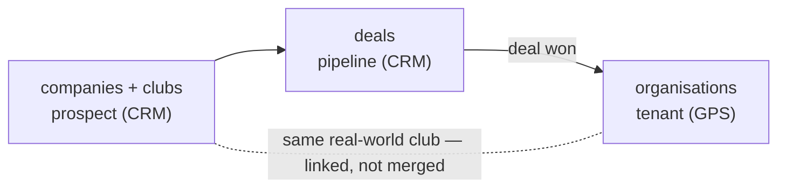

# 07 · CRM ↔ GPS integration

How the CRM relates to GPS, and the decisions that follow. Based on the GPS org/identity context from the GPS team. The goal is a shared picture so CRM design and GPS stay compatible — **not** to merge the two schemas.

> **The CRM does not build its schema around GPS.** GPS is a separate multi-tenant product on a separate host, read-only over an ETL feed. The CRM keeps its own schema; the two systems reconcile through a single link field and (optionally) a shared login. Link, do not merge.

**Integration principle (agreed with Diego).** The CRM↔GPS integration is **standardization**, not structural merge: both systems should use the **same vocabulary and naming** for shared concepts (org types, the `organisation` term, slug/timestamp/soft-delete conventions, `bigint` identity PKs) so they "speak the same way." Beyond that, **each system keeps the shape useful to its own purpose** — the CRM models the football org world-model the way selling needs it (see docs 03/04), GPS keeps its tenant/RBAC model. The only structural tie is the `clubs.gps_org_id` link.

---

## 1. One word, two meanings

The word *organisation* means two different things in the two systems. Keeping them separate is the whole point.

| | **GPS · `organisation`** | **CRM · `company` / `club`** |
|---|---|---|
| It is | A **tenant** | A **sales target** |
| Meaning | A club/federation that **bought GPS** and whose staff log in | A club/agency/media/service Goalkeeper is **selling to** |
| Role | The multi-tenancy boundary — every row & permission hangs off it | A record tracked through a pipeline; CRM is used only by Goalkeeper staff |
| Tables | `organisations` · `users` · `user_organisations` | `companies` · `clubs` · `company_contacts` |

The same real club (e.g. Middlesbrough FC) is **two records, in two databases, doing two jobs**. It lives a lifecycle across the systems: a prospect in the CRM that, the day it buys, becomes a tenant in GPS.

---

## 2. The GPS org spine (for reference)

Three tables carry GPS's multi-tenant model. Identity lives outside the database in Microsoft Entra; GPS stores only a link to it.

- `users` (id, `entra_oid` UK, email, locale) — a local shadow of a Microsoft Entra account.
- `organisations` (id, name, slug UK, deleted_at) — the tenant.
- `user_organisations` (user_id, org_id, is_admin) — multi-org membership; `is_admin` lives here, not on `users`.

Access is four layers: **identity** (Entra), **RBAC** (roles/entitlements, org-scoped), **commercial** (`org_features` = what they bought), **data scope** (per-user, down to a team). Deny by default. Conventions: `bigint` identity PKs, `created_at`/`updated_at`, soft delete via `deleted_at`, unique `slug` per org.

**One identity, many products:** a single Entra tenant already serves GPS and Bouncy (Goalkeeper.com v2) and is intended for future products. Identity is shared; each product keeps its own authorisation private.

---

## 3. GPS concept → CRM equivalent

| GPS | CRM | Relationship |
|---|---|---|
| `organisations` (tenant) | `companies` + `clubs` (sales target) | Different purpose — same club, different rows. Link, don't merge (decision B). |
| `users` (Entra person) | `sales` (staff) | Could converge — candidate to share the Entra tenant (decision A). |
| `user_organisations` (membership) | none | Not needed — CRM is single-tenant. |
| `roles` / `entitlements` (RBAC) | RBAC at M6 | Adopt the GPS pattern as a template. |
| `org_features` (what they bought) | `company_brands` / `deal_modules` (what we sold) | Two ends of the same fact. |
| `bigint` identity PKs | `bigint` identity PKs | Already aligned; external IDs kept off the PK. |

---

## 4. The two decisions

"Use the same orgs structure" resolves into two independent decisions (do either, both, or neither).

### Decision A — How staff log into the CRM — ✅ RESOLVED

**Google OAuth on Supabase.** The CRM keeps its own auth; it does **not** join the shared Entra tenant. CRM and GPS stay separate systems, so coupling identity would add complexity for little gain. `sales` gets **no `entra_oid`**.

### Decision B — How a club reconciles across both systems

The CRM is read-write (react-admin); the GPS app is read-only over an ETL feed. Different rows in different databases, so a real foreign key is impossible — the link is a **logical reference**.

| Option | What it means |
|---|---|
| 1 · One shared org table | Tightest consistency, but couples two DBs with opposite write models. Heavy. |
| **2 · A link field** *(recommended)* | Each system keeps its rows; one reference column reconciles them — `clubs.gps_org_id` (CRM side) or `organisations.crm_company_id` (GPS side). Loose coupling. |
| 3 · Shared external key | Reconcile on an id both already hold (CRM `coda_row_id`/`legacy_ref` vs a GPS `slug`/external id). No new column, weaker guarantee — and risky here, since Coda names aren't unique (Aberdeen appears twice). |

**How the link field works (recommended path):**

1. Add a nullable `clubs.gps_org_id`. It stays null while the club is a prospect.
2. A deal moves to `won`.
3. A GPS `organisations` row (the tenant) is created — the *provisioning* step.
4. That new GPS org id is written back into `clubs.gps_org_id`. Only now are they linked.

To follow the link afterwards: an **app/ETL lookup**, not a SQL `JOIN` (separate databases).

---

## 5. Schema deltas (small & additive)

- **`clubs.gps_org_id`** (nullable, unique) — the reconciliation link; populated on deal-won.
- **`sales.entra_oid`** — not adopted; auth is Google OAuth on Supabase (decision A).
- **RBAC at M6** — adopt the GPS 4-layer pattern (`roles` · `entitlements` · `role_entitlements` · `user_roles`, org-scoped) rather than inventing one. Pattern, not now.
- **No `user_organisations` equivalent** — the CRM is single-tenant.
- **Conventions to align now** (cheap now, a migration later): `created_at`/`updated_at` everywhere, soft delete via `deleted_at` on mutable tables, and the link-field shape. PKs already match (`bigint` identity); external IDs kept off the PK.

These deltas are reflected in docs 03 (schema), 04 (ERD), 05 (decisions) and 06 (plan).

---

## 6. Questions for the team

1. **Is the CRM ever multi-tenant, or always internal?** Drives whether anything like `user_organisations` is ever needed.
2. **Do CRM staff log in through the shared Entra tenant?** (Decision A) — ✅ **No.** Google OAuth on Supabase; CRM and GPS stay separate.
3. **At M6, adopt the GPS RBAC pattern or roll our own?** Decide before building M6.
4. **How does a club link across CRM and GPS?** (Decision B) Link-field vs shared-key — drives whether GPS adds `crm_company_id` or we rely on an existing external id.
5. **Who provisions the GPS tenant when a deal closes?** On deal-won, is the GPS `organisation` created manually or via an event/handoff? Defines the "system of record" boundary.
6. **Which conventions do we agree to share now?** PKs already match; align timestamps, soft-delete, and the link-field shape early so a future join is cheap.

---

### Source

GPS structure from the GPS team's *How GPS models organisations & identity* (GPS V1 Technical Definition §5–§6). This is context, not a spec — nothing here commits GPS or the CRM to a design.
